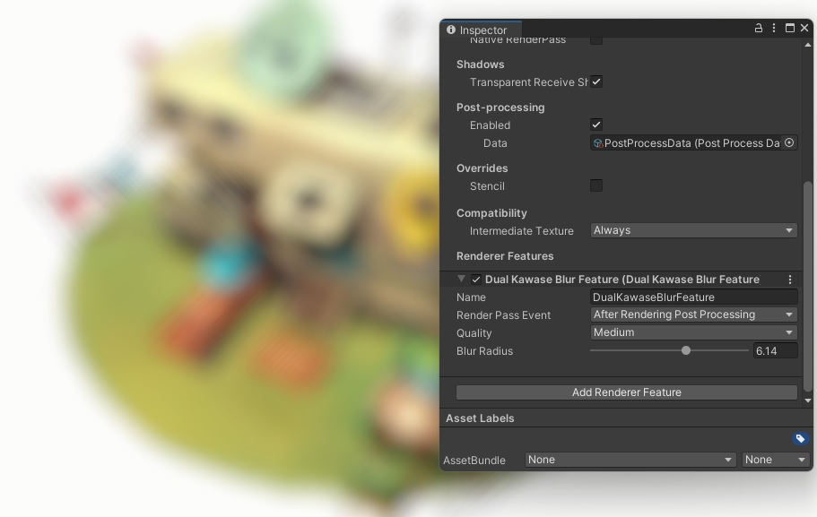
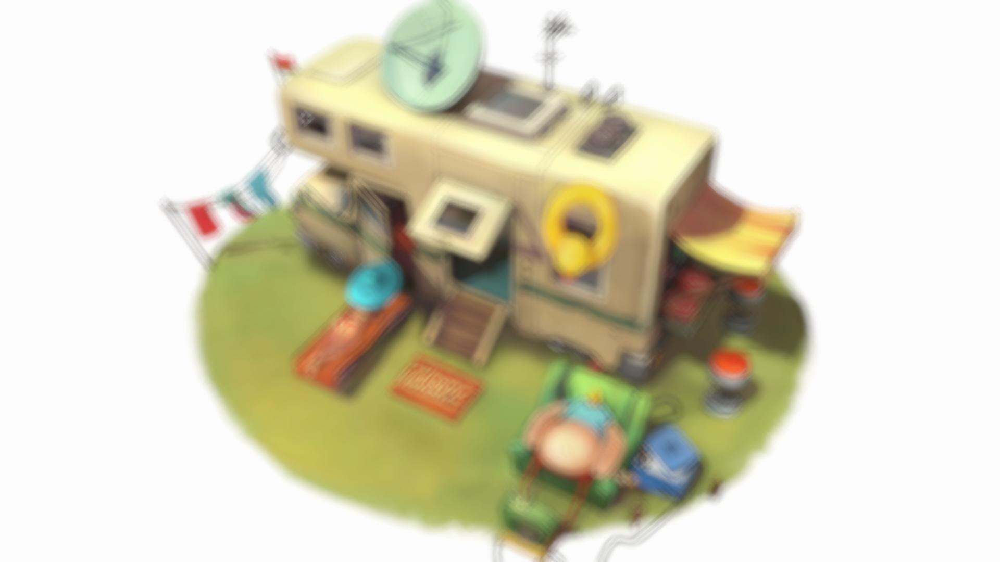
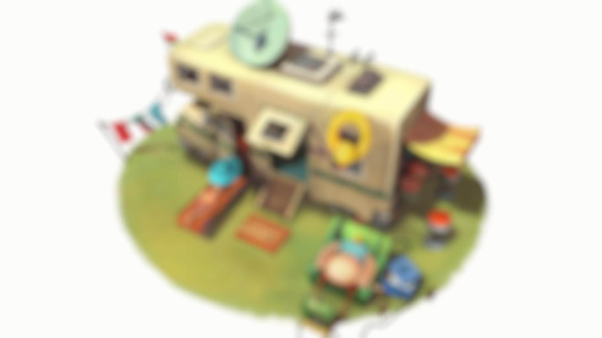
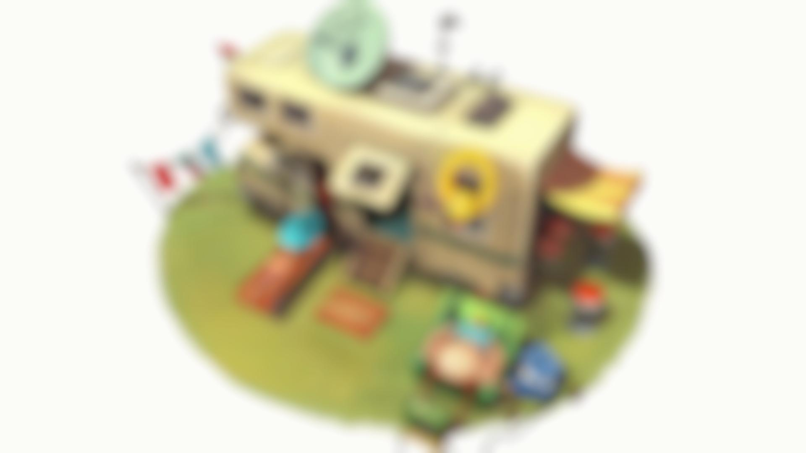

# Dual Kawase Blur Demo
URP 12 implementation of the Dual Kawase Blur method described in [SIGGRAPH 2015 by Marius Bjørge](https://community.arm.com/cfs-file/__key/communityserver-blogs-components-weblogfiles/00-00-00-20-66/siggraph2015_2D00_mmg_2D00_marius_2D00_notes.pdf). 

3D Model in `Demo.scene` by Alyona Shek. 
Provided under [CC4.0](https://creativecommons.org/licenses/by/4.0/). 
No Changes were made to the model. 
View it on [Sketchfab](https://sketchfab.com/3d-models/trailer-040ad3bbf0c54098b90a87ac517d3901).

## Unity Package
Available [here](https://github.com/Baedrick/Dual-Kawase-Blur)!

## Settings
### Render Pass Event
Refers to where in the rendering pipeline this feature is injected into.
Usually you would perform blurs after all post-processing effects.

### Blur Radius
Refers to how blurry the resulting image is. Higher values means blurrier.

### Quality
Quality directly relates to the number of passes for the blur.
- **Low**: 3 Draw calls (1 Downsample, 1 Upscale, 1 Copy), Blur Radius 5.0.
  
- **Medium**: 5 Draw calls (2 Downsample, 2 Upscale, 1 Copy), Blur Radius 2.5.
  
- **High**: 7 Draw calls (3 Downsample, 3 Upscale, 1 Copy), Blur Radius 1.25.
  
